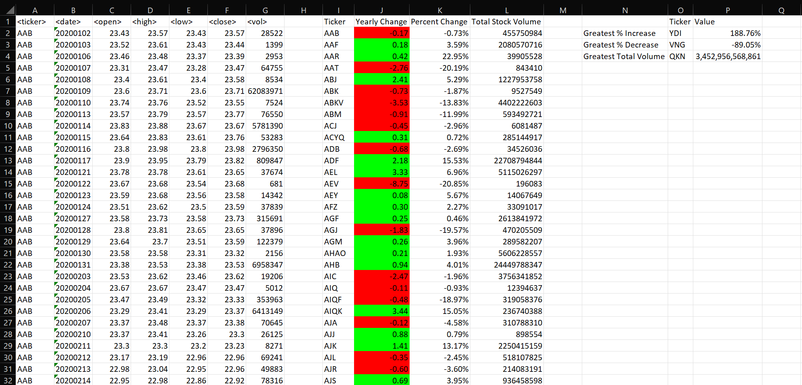

# Challenge 2 - VBA

This repo contains a [VBA script](vba_challenge.vbs) for looping through stock data in an excel workbook and generating a totals table for each year with information for every stock in the year.

After creating the yearly totals and change data, the script will then find the largest % increase, % decrease, and largest total volume and output the information in another table.

## Results
After running the script on the full Multiple_year_stock_data.xlsx file, the following was displayed.
### 2018

### 2019

### 2020

